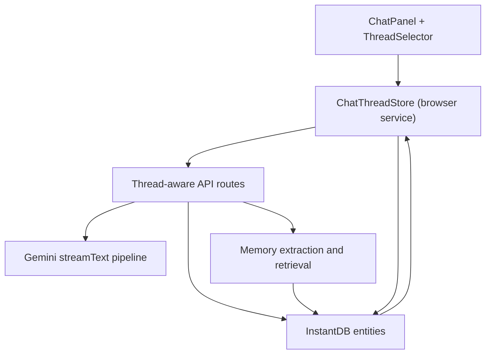
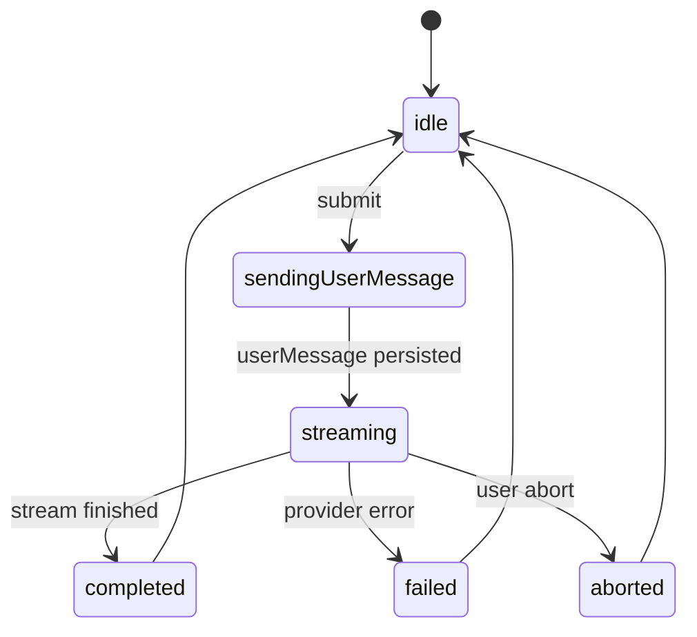

# AI Chat Persistent Memory and Threading Spec

## 1. Current Baseline (from this codebase)

- Chat history is local component state in `features/agent/components/chat-panel.tsx` (`const [messages, setMessages] = useState...`).
- "Recent chats" UI is currently decorative (clock icon in `features/agent/components/chat-panel.tsx`).
- Chat backend (`app/api/agent/chat/route.ts`) is stateless request/response streaming.
- There is no thread service yet (`services/agent/browser/chatManagerService.ts` is a stub).
- Feature-level chat API wrapper is also a stub (`features/agent/services/chat-api.ts`).
- Staged file changes already support `sourceMessageId` linkage in `features/agent/services/change-manager.ts`.

This means refresh/navigation loses thread history, and there is no persistent memory retrieval path for future prompts.

## 2. Goals

1. Persist chat threads and messages per user and project.
2. Restore and switch threads in UI.
3. Add durable memory layer (facts/preferences/summaries) used in prompt assembly.
4. Keep streaming UX and staged file-change linkage unchanged.
5. Support safe recovery for interrupted streams.

## 3. Proposed Architecture

Core rule: mirror Void's pattern by separating:
- persistent state: thread/message/memory entities.
- runtime state: active stream/abort handles/retry state in memory only.

## 4. Data Model (InstantDB)

Add entities in `instant.schema.ts`:

1. `ai_threads`
- `project_id: string indexed`
- `user_id: string indexed`
- `title: string optional`
- `status: string optional` (`active | archived`)
- `last_message_preview: string optional`
- `last_message_at: string indexed optional`
- `created_at: string indexed`
- `updated_at: string indexed`
- `summary: string optional` (rolling summary for long threads)
- `summary_version: number optional`

2. `ai_messages`
- `thread_id: string indexed`
- `project_id: string indexed`
- `user_id: string indexed`
- `role: string indexed` (`system | user | assistant | tool`)
- `content: string optional`
- `seq: number indexed` (strict monotonic ordering within thread)
- `status: string optional` (`completed | error | interrupted`)
- `error: string optional`
- `source_message_id: string optional` (already used by staged changes)
- `token_estimate: number optional`
- `created_at: string indexed`
- `updated_at: string indexed`

3. `ai_runs`
- `thread_id: string indexed`
- `message_id: string indexed`
- `request_id: string indexed`
- `status: string indexed` (`streaming | completed | failed | aborted`)
- `model: string optional`
- `started_at: string indexed`
- `ended_at: string optional`
- `failure_reason: string optional`

4. `ai_memory_items`
- `user_id: string indexed`
- `project_id: string indexed optional`
- `thread_id: string indexed optional`
- `scope: string indexed` (`user | project | thread`)
- `kind: string indexed` (`preference | fact | constraint | summary`)
- `content: string`
- `source_message_id: string optional`
- `salience: number optional` (0-1)
- `last_used_at: string optional`
- `created_at: string indexed`
- `updated_at: string indexed`

5. `ai_thread_checkpoints` (optional now, useful later)
- `thread_id: string indexed`
- `message_seq: number indexed`
- `label: string optional`
- `payload: any optional` (for future tool/apply snapshots)
- `created_at: string indexed`

Permissions in `instant.perms.ts`:
- For all new entities, use owner checks: `auth.id != null && auth.id == data.user_id`.
- For project-scoped reads, keep user ownership as source of truth.

## 5. API Contracts

Create new API surface under `app/api/agent/threads`:

1. `POST /api/agent/threads`
- Request: `{ projectId: string, title?: string }`
- Response: `{ threadId, createdAt }`

2. `GET /api/agent/threads?projectId=...&limit=...&cursor=...`
- Response: `{ items: ThreadSummary[], nextCursor?: string }`

3. `GET /api/agent/threads/:threadId/messages?limit=...&cursor=...`
- Response: `{ items: ChatMessageDto[], nextCursor?: string }`

4. `PATCH /api/agent/threads/:threadId`
- Request: `{ title?: string, status?: "active" | "archived" }`

5. `POST /api/agent/threads/:threadId/messages`
- Request:
  - `projectId`
  - `userMessage`
  - `model?`
  - `context: { currentFileName?, currentFileContent?, stagedSelections? }`
  - `clientMessageId?` (idempotency)
- Response: stream (text deltas)
- Side effects:
  - insert user message row.
  - create `ai_runs` row (`status=streaming`).
  - assemble memory/context and call `streamText`.
  - finalize assistant message row.
  - update thread metadata.
  - mark run completed or failed.

6. `POST /api/agent/threads/:threadId/abort`
- Request: `{ requestId: string }`
- Action: abort active run, persist run/message status as `aborted/interrupted`.

Keep existing `app/api/agent/chat/route.ts` during migration as compatibility path, then deprecate.

## 6. Prompt Assembly Pipeline

For each completion request:

1. Load thread metadata + latest summary.
2. Load top-k memory items:
- user scope first (preferences, stable constraints).
- then project scope.
- then thread scope.
3. Load recent message window by token budget.
4. Optionally include current editor file context (existing behavior).
5. Build prompt:
- system core
- memory section
- thread summary section
- recent turns
- current user turn

Token budgeting:
- reserve output budget.
- hard cap memory section.
- summarize old turns into `ai_threads.summary` when thread exceeds threshold.

## 7. Runtime State Machine

UI state should keep:
- `threadState`: persisted data and optimistic updates.
- `runState`: ephemeral `{ requestId, isStreaming, error, abortController }`.

## 8. Step-by-Step File Plan

1. Extend schema and perms:
- `instant.schema.ts`
- `instant.perms.ts`

2. Add thread service layer:
- `features/agent/services/chat-threads-store.ts` (new)
- `features/agent/services/chat-api.ts` (replace stub)
- `services/agent/browser/chatManagerService.ts` (real implementation)

3. Add API routes:
- `app/api/agent/threads/route.ts`
- `app/api/agent/threads/[threadId]/route.ts`
- `app/api/agent/threads/[threadId]/messages/route.ts`
- `app/api/agent/threads/[threadId]/abort/route.ts`

4. Update chat client:
- `services/agent/browser/quick-edit/chatService.ts`
  - add thread-aware generate signature:
  - `generate({ threadId, projectId, userMessage, messages?, model?, context? })`

5. Update UI:
- `features/agent/components/chat-panel.tsx`
  - replace local `messages` source with thread store.
  - add thread selector and "new thread".
  - wire "Recent chats" button to real list.
- `app/project/[id]/page.tsx`
  - pass `projectId`, `currentUserId` to chat panel/service.

6. Memory extraction:
- `features/agent/services/memory-extractor.ts` (new)
  - initial rule-based extraction from assistant/user text.
  - write `ai_memory_items`.
- integrate call after assistant completion in messages route.

## 9. Migration Plan

Phase 0 (safe prep):
- add schema/perms.
- deploy without UI changes.

Phase 1 (thread persistence):
- create thread APIs and store service.
- persist/reload messages.
- keep current model streaming behavior.

Phase 2 (UI thread UX):
- thread list, create/switch/archive.
- default behavior: auto-open most recent active thread.

Phase 3 (memory retrieval):
- memory entity writes + retrieval in prompt assembly.
- add summary rotation for long threads.

Phase 4 (resilience):
- run recovery on page reload.
- detect `ai_runs.status=streaming` older than timeout and mark interrupted.

## 10. Acceptance Criteria

1. Refreshing the project page restores the same active thread and full message history.
2. User can create/switch/delete/archive threads without losing prior content.
3. Assistant responses can reference memory entries saved from prior turns.
4. Streaming interruption leaves durable message/run status (`aborted` or `failed`).
5. Existing staged file-change flow remains linked via `sourceMessageId`.

