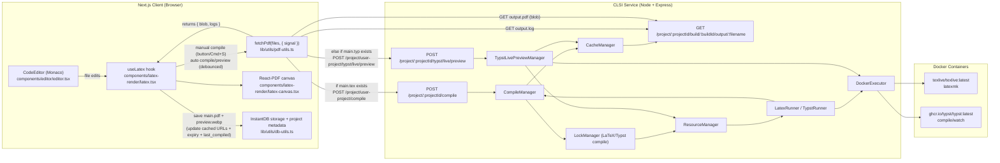
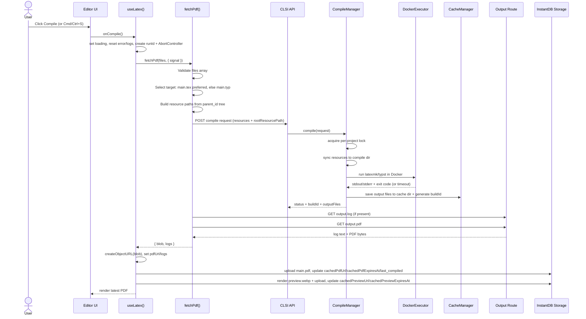

# LaTeX to PDF System Design (Current Implementation)

This document explains the current end-to-end flow in this repository: how editor content becomes a rendered/downloadable PDF, where files are stored, and how errors/logs move through the system.

## 1) End-to-End Architecture Diagram



## 2) Runtime Sequence (Manual Compile)



## 3) Main Components and Responsibilities

| Layer | Component | Responsibility |
| --- | --- | --- |
| Frontend | `components/editor/editor.tsx` | Emits cursor clicks/line counts, source editing events. |
| Frontend | `components/latex-render/latex.tsx` (`useLatex`) | Compile orchestration, aborting stale auto-runs, local object URL lifecycle, UI state. |
| Frontend | `lib/utils/pdf-utils.ts` | Resource packaging, CLSI endpoint calls, log fetch + PDF fetch, error shaping. |
| Frontend | `lib/utils/db-utils.ts` | Persist PDF and preview to InstantDB storage, update project cached URLs and expiry metadata. |
| CLSI | `services/clsi/src/api/routes.ts` | Compile/preview/output routes. |
| CLSI | `services/clsi/src/core/CompileManager.ts` | Locking, resource sync, compiler execution, output caching (LaTeX + non-live Typst). |
| CLSI | `services/clsi/src/core/TypstLivePreviewManager.ts` | Warm Typst watch-session preview path. |
| CLSI | `services/clsi/src/core/DockerExecutor.ts` | Sandboxed container execution (network control, limits, timeout kill). |
| CLSI | `services/clsi/src/core/CacheManager.ts` | Build ID generation, output file copy, URL construction, old build cleanup. |
| CLSI | `services/clsi/src/core/ResourceManager.ts` | Writes resources to disk and validates paths against traversal. |

## 4) Detailed Walkthrough (Easy to Learn)

### Step 0: Project starts with a compile entry file
1. New project creation writes `main.tex` into files data (`app/new/page.tsx`).
2. During editing, file content is stored in InstantDB (`components/editor/cursor-editor-container.tsx` + `hooks/data.ts`).

### Step 1: A compile trigger happens
1. Manual compile:
   - User presses the Compile button or Cmd/Ctrl+S.
2. Auto compile/preview:
   - `useLatex` debounces source changes.
   - It compiles when auto mode is enabled, and for Typst it always enables quick preview behavior.

### Step 2: Frontend selects the compile mode
1. `fetchPdf` checks whether files include `main.tex` or `main.typ`.
2. Selection rule:
   - If `main.tex` exists, it uses LaTeX (`pdflatex` via `/project/user-project/compile`).
   - Otherwise it uses Typst live preview (`/project/user-project/typst/live/preview`).

### Step 3: Frontend packages resources
1. It builds full resource paths from each file’s parent chain (`parent_id`), preserving folder structure.
2. It posts a resource array to CLSI with:
   - `rootResourcePath` (`main.tex` or `main.typ`)
   - compiler (for LaTeX path)
   - resource content payloads

### Step 4: CLSI receives request and runs compile
1. Express route validates input with Zod.
2. Compile path (`/compile`) goes through `CompileManager`:
   - Acquire lock for project ID.
   - Sync files to compile directory.
   - Clear old `output.*` artifacts.
   - Run compiler in Docker.
   - Cache outputs and return build metadata.
3. Typst live path (`/typst/live/preview`) goes through `TypstLivePreviewManager`:
   - Maintains warm watch containers per project.
   - Waits for updated output/log signals.
   - Caches output and returns build metadata.

### Step 5: Docker execution details
1. LaTeX runs with `latexmk` and writes `output.pdf`, `output.log`, `output.synctex.gz`.
2. Containers run with hardening and limits (network policy, dropped capabilities, CPU/memory/time constraints).
3. On timeout, container is killed and CLSI returns structured error status.

### Step 6: CLSI cache + output serving
1. `CacheManager` creates a `buildId`.
2. It copies output artifacts into:
   - `${OUTPUT_DIR}/{projectId}/builds/{buildId}/...`
3. API returns URLs like:
   - `/project/{projectId}/build/{buildId}/output/output.pdf`
   - `/project/{projectId}/build/{buildId}/output/output.log`
4. Cleanup policy:
   - Keep only recent builds by count and age.

### Step 7: Frontend retrieves artifacts
1. `fetchPdf` calls output URL for `output.log` (if present).
2. Then fetches `output.pdf` as `Blob`.
3. Returns `{ blob, logs }` to `useLatex`.

### Step 8: UI update and persistence
1. `useLatex` creates a local object URL and updates PDF panel immediately.
2. In parallel, it persists:
   - `main.pdf` to InstantDB storage.
   - `preview.webp` generated from page 1 of the PDF.
3. It updates project metadata:
   - `cachedPdfUrl`, `cachedPdfExpiresAt`, `last_compiled`
   - `cachedPreviewUrl`, `cachedPreviewExpiresAt`

### Step 9: Later reload behavior
1. On project load, `useLatex` first shows `cachedPdfUrl` if available.
2. Dashboard cards refresh expiring cached URLs and reuse preview/PDF links.

### Step 10: Error + logs behavior
1. Validation errors return HTTP 400.
2. Compilation failures are returned as structured compile status with output references where available.
3. Frontend displays:
   - human-readable error panel
   - raw compile logs panel (`output.log`)

## 5) Data Contracts (Current)

### Frontend -> CLSI (LaTeX compile)

```json
{
  "compiler": "pdflatex",
  "rootResourcePath": "main.tex",
  "resources": [
    { "path": "main.tex", "content": "..."}
  ]
}
```

### Frontend -> CLSI (Typst live preview)

```json
{
  "rootResourcePath": "main.typ",
  "resources": [
    { "path": "main.typ", "content": "..."}
  ]
}
```

### CLSI -> Frontend (success shape)

```json
{
  "status": "success",
  "buildId": "hexTimestamp-randomHex",
  "outputFiles": [
    {
      "path": "output.pdf",
      "type": "pdf",
      "url": "/project/user-project/build/{buildId}/output/output.pdf",
      "size": 12345
    }
  ]
}
```

## 6) Operational Notes

1. Frontend CLSI base URL is from `NEXT_PUBLIC_CLSI_URL` (fallback `http://localhost:3013`).
2. CLSI CORS allows broad local development and strict origin checks in production.
3. `compile/stop` endpoint exists, but LaTeX compile stop handling is currently minimal in `CompileManager`.
4. Output route is a pull model: frontend reads PDF/logs only after compile metadata is returned.

