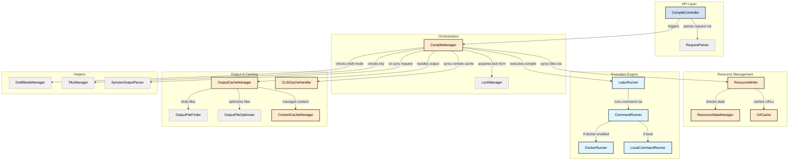

```mermaid
graph TD
%% Styling
classDef controller fill:#d4e1f5,stroke:#333,stroke-width:2px,color:#000;
classDef manager fill:#ffebcd,stroke:#333,stroke-width:2px,color:#000;
classDef runner fill:#e1f5fe,stroke:#333,stroke-width:2px,color:#000;
classDef util fill:#f0f0f0,stroke:#999,stroke-width:1px,color:#000;

    %% Nodes
    subgraph "API Layer"
        CC[CompileController]:::controller
        RP[RequestParser]:::util
    end

    subgraph "Orchestration"
        CM[CompileManager]:::manager
        LM[LockManager]:::util
    end

    subgraph "Resource Management"
        RW[ResourceWriter]:::manager
        RSM[ResourceStateManager]:::manager
        UC[UrlCache]:::manager
    end

    subgraph "Execution Engine"
        LR[LatexRunner]:::runner
        CR[CommandRunner]:::runner
        DR[DockerRunner]:::runner
        LCR[LocalCommandRunner]:::runner
    end

    subgraph "Output & Caching"
        OCM[OutputCacheManager]:::manager
        OFF[OutputFileFinder]:::util
        CCH[CLSICacheHandler]:::manager
        OFO[OutputFileOptimiser]:::util
        CCM[ContentCacheManager]:::manager
    end

    subgraph "Helpers"
        DMM[DraftModeManager]:::util
        TM[TikzManager]:::util
        SOP[SynctexOutputParser]:::util
    end

    %% Relations
    CC -- parses request via --> RP
    CC -- triggers --> CM
    CM -- acquires lock from --> LM
    CM -- syncs files via --> RW
    CM -- checks draft mode --> DMM
    CM -- checks tikz --> TM
    CM -- executes compile --> LR
    CM -- handles output --> OCM
    CM -- syncs remote cache --> CCH
    RW -- checks state --> RSM
    RW -- caches URLs --> UC
    LR -- runs command via --> CR
    CR -- "if docker enabled" --> DR
    CR -- "if local" --> LCR
    OCM -- finds files --> OFF
    OCM -- optimizes files --> OFO
    OCM -- manages content --> CCM
    CM -- "on sync request" --> SOP
```
