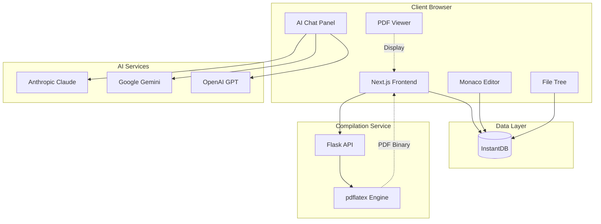
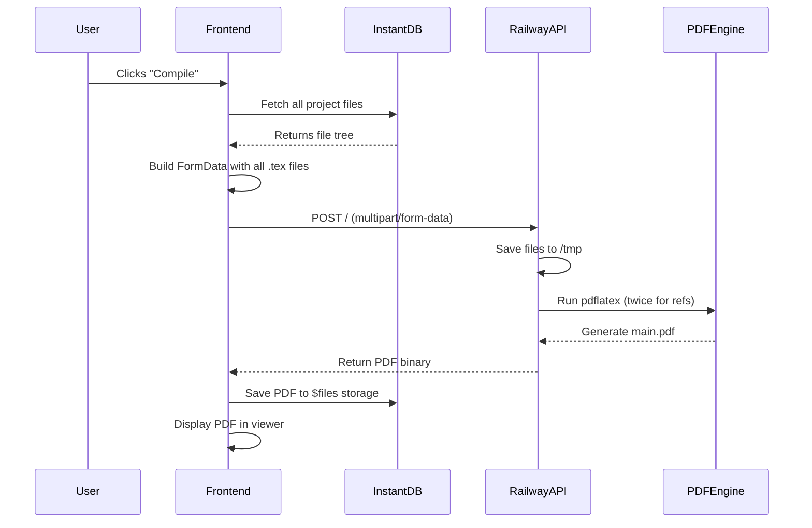

# Jules/Clarity - Comprehensive Project Overview

## Product Vision

**Jules** (branded as "Clarity Research") is an **AI-powered collaborative LaTeX editor** designed to make academic and technical writing more accessible and efficient. It combines the precision of LaTeX with modern web technologies, real-time collaboration, and integrated AI assistance.

---

## Technology Stack

### Frontend

- **Framework**: Next.js 15 (React 19) with App Router
- **Language**: TypeScript
- **Styling**: Tailwind CSS with custom design system
- **UI Components**:
  - Radix UI primitives (Dialog, Dropdown, Popover, etc.)
  - shadcn/ui component library
  - Custom components for editor, file tree, and navigation
- **Editor**: Monaco Editor with custom LaTeX language support
- **PDF Rendering**: react-pdf (PDF.js)
- **Animations**: Framer Motion
- **State Management**: React Context API + InstantDB

### Backend & Services

- **Database/Auth**: InstantDB (Firebase alternative with real-time capabilities)
- **LaTeX Compilation**: Python/Flask microservice (`railway-api`)
  - Currently runs `pdflatex` directly in container
  - Deployed on Railway or similar platform
- **AI Integration**: Vercel AI SDK with multiple providers:
  - Anthropic (Claude)
  - Google (Gemini)
  - OpenAI (GPT)

### Infrastructure

- **Deployment**: Vercel (frontend), Railway (backend)
- **Package Manager**: npm
- **Build Tool**: Next.js built-in bundler
- **Docker**: Multi-stage builds for both dev and production

---

## Architecture Overview

### High-Level System Architecture



### Frontend Architecture (Next.js)

#### App Router Structure

```
app/
├── (dashboard)/           # Route group for authenticated pages
│   ├── projects/         # Project listing page
│   └── new/             # New project creation
├── project/[id]/        # Editor workspace (dynamic route)
├── login/               # Authentication page
├── actions.tsx          # Server actions
├── layout.tsx           # Root layout
└── page.tsx            # Landing page
```

#### Component Organization

```
components/
├── editor/             # Monaco editor wrapper & configuration
│   ├── editor.tsx
│   ├── cursor-style-layout.tsx
│   └── hooks/         # Editor-specific hooks (syntax, autocomplete)
├── file-tree/         # Project file system navigator
├── latex-render/      # PDF viewer components
├── layout/            # App layout components (sidebar, panels)
├── nav/              # Navigation bars
├── projects/         # Project cards, list views
└── ui/               # Reusable UI primitives (shadcn/ui)
```

#### Feature Modules

```
features/
├── ai-chat/          # AI assistant integration
│   ├── components/  # Chat UI, message bubbles
│   ├── services/    # API calls to AI providers
│   └── hooks/       # Chat state management
├── source-editor/   # Editor-specific features
└── languages/       # Language support (LaTeX linter, formatter)
    └── latex/
        └── linter/
```

---

## Core Systems

### 1. Data Model (InstantDB Schema)

Jules uses **InstantDB** as a real-time database with built-in authentication and subscriptions.

#### Entities

**`projects`** - User's LaTeX projects

```typescript
{
  id: string
  created_at: string
  title: string
  template: string // e.g., "IEEE Conference", "Blank"
  document_class: string // e.g., "article", "IEEEtran"
  user_id: string
  last_compiled: string
  page_count: number
  word_count: number
  project_content: string // Cached main.tex preview
}
```

**`files`** - Project files (LaTeX, images, etc.)

```typescript
{
  id: string
  projectId: string
  user_id: string
  name: string // e.g., "main.tex", "references.bib"
  pathname: string // Full path e.g., "main.tex", "figures/plot.png"
  type: 'file' | 'folder'
  content: string // File content (text or data URL for images)
  parent_id: string | null
  isOpen: boolean // UI state: is file open in editor
  isExpanded: boolean // UI state: folder expansion
  created_at: string
}
```

**`users`** - Application users

```typescript
{
  id: string
  email: string
  created_at: string
  type: 'guest' | 'authenticated'
  isGuest: boolean
  app_id: string
  refresh_token: string
}
```

**`$users`** - InstantDB system table for authentication

**`$files`** - InstantDB storage table for uploaded media

```typescript
{
  path: string(unique, indexed)
  url: string
}
```

### 2. LaTeX Compilation Flow



**Key Files:**

- Frontend: [`lib/utils/pdf-utils.ts`](file:///Users/andersonchen/Downloads/jules-main/lib/utils/pdf-utils.ts) - `fetchPdf()`
- Frontend: [`components/latex-render/latex.tsx`](file:///Users/andersonchen/Downloads/jules-main/components/latex-render/latex.tsx) - `useLatex()` hook
- Backend: [`railway-api/main.py`](file:///Users/andersonchen/Downloads/jules-main/railway-api/main.py) - Flask endpoints

**Compilation Process (Backend):**

1. Receive multipart file upload
2. Validate `main.tex` exists and is not empty
3. Save all files to temporary directory
4. Run `pdflatex -shell-escape -output-directory /tmp main.tex` (first pass)
5. Run second pass for cross-references
6. Read generated PDF and return as binary response
7. Clean up temporary files

### 3. Real-Time Collaboration Architecture

Jules uses **InstantDB's reactive queries** for real-time collaboration:

```typescript
// Example: Real-time file updates
const { data, isLoading } = db.useQuery({
  files: {
    $: {
      where: {
        projectId: projectId,
        user_id: userId,
      },
    },
  },
})
```

**Features:**

- **Live Cursors**: (Planned - not yet implemented)
- **File Sync**: Changes to files are immediately visible to all collaborators
- **Project State**: Auto-save for scale, scroll position, panel sizes

### 4. AI Chat Integration

The AI chat system provides contextual assistance while editing.

**Architecture:**

- **Frontend**: [`features/ai-chat/`](file:///Users/andersonchen/Downloads/jules-main/features/ai-chat)
- **API Routes**: [`app/actions.tsx`](file:///Users/andersonchen/Downloads/jules-main/app/actions.tsx)
- **Providers**: Anthropic Claude, Google Gemini, OpenAI GPT

**Flow:**

1. User types message in chat panel
2. Frontend sends message + context (current file, selection) to server action
3. Server action calls AI provider via Vercel AI SDK
4. Streaming response rendered in chat UI
5. AI can suggest LaTeX code, explain errors, format references

**Key Components:**

- `<AIChatPanel>` - Chat UI container
- `<MessageList>` - Displays conversation
- `<ChatInput>` - User input with send button
- `useChatStream()` - Manages streaming responses

### 5. Editor System (Monaco)

The editor is a heavily customized Monaco instance with LaTeX support.

**Key Customizations:**

- **Language Support**: Custom LaTeX tokenizer and syntax highlighting
- **Auto-completion**: LaTeX commands, environments, citations
- **Linting**: Real-time error detection (planned)
- **Bracket Matching**: Auto-close for `\begin{...}` / `\end{...}`

**Files:**

- [`components/editor/editor.tsx`](file:///Users/andersonchen/Downloads/jules-main/components/editor/editor.tsx)
- [`components/editor/hooks/useEditorSetup.tsx`](file:///Users/andersonchen/Downloads/jules-main/components/editor/hooks/useEditorSetup.tsx)
- [`components/editor/hooks/useLatexSyntaxHighlighting.tsx`](file:///Users/andersonchen/Downloads/jules-main/components/editor/hooks/useLatexSyntaxHighlighting.tsx)
- [`features/languages/latex/linter/`](file:///Users/andersonchen/Downloads/jules-main/features/languages/latex/linter)

### 6. File Tree System

The file tree is built using **react-arborist** for drag-and-drop and nested structures.

**Features:**

- Create/rename/delete files and folders
- Drag-and-drop to reorganize
- Context menu for file operations
- Synchronized with InstantDB in real-time

**Components:**

- [`components/file-tree/file-tree.tsx`](file:///Users/andersonchen/Downloads/jules-main/components/file-tree/)

---

## Key User Flows

### 1. Creating a New Project

```
Landing Page → Login → Dashboard → "New Project"
  → Select Template (Blank, IEEE, Resume, etc.)
  → Project Created with default files (main.tex)
  → Redirect to Editor
```

### 2. Editing and Compiling

```
Open Project → View Files in Sidebar
  → Click file to open in Editor
  → Edit LaTeX source
  → (Auto-compile if enabled) OR Click "Compile" button
  → Backend generates PDF
  → PDF displayed in right panel
  → Download PDF (optional)
```

### 3. Using AI Assistant

```
Editor Open → Click AI Chat icon
  → Type question (e.g., "How do I add a table?")
  → AI streams response with LaTeX example
  → Copy code to editor
  → Compile to see result
```

---

## Deployment & Infrastructure

### Frontend (Vercel)

- **Build Command**: `npm run build`
- **Output Directory**: `.next`
- **Environment Variables**:
  - `NEXT_PUBLIC_INSTANT_APP_ID` - InstantDB app ID
  - `NEXT_PUBLIC_RAILWAY_ENDPOINT_URL` - Backend API URL
  - `ANTHROPIC_API_KEY` - Claude API key
  - `GOOGLE_GENERATIVE_AI_API_KEY` - Gemini key
  - `OPENAI_API_KEY` - GPT key

### Backend (Railway)

- **Base Image**: `python:3.11-slim`
- **Dependencies**: Flask, pdflatex, texlive packages
- **Dockerfile**: [`railway-api/Dockerfile`](file:///Users/andersonchen/Downloads/jules-main/railway-api/Dockerfile)
- **Start Command**: `hypercorn main:app --bind 0.0.0.0:8000`

### Database (InstantDB)

- **Type**: Managed service (no self-hosting)
- **Schema**: Defined in [`instant.schema.ts`](file:///Users/andersonchen/Downloads/jules-main/instant.schema.ts)
- **Permissions**: Defined in [`instant.perms.ts`](file:///Users/andersonchen/Downloads/jules-main/instant.perms.ts)

---

## Security Considerations

### Current Risks

1. **Shell Escape Vulnerability**: Running `pdflatex -shell-escape` in the API container allows arbitrary command execution
2. **No Sandboxing**: LaTeX compilation happens in the same container as the web API
3. **No Rate Limiting**: Users can spam compile requests

### Recommended Improvements

(See [`dev-plans/compilation-service-proposal.md`](file:///Users/andersonchen/Downloads/jules-main/dev-plans/compilation-service-proposal.md))

- Isolate compilation in ephemeral Docker containers
- Implement queue-based processing
- Add resource limits (CPU, memory, timeout)
- Remove `-shell-escape` flag or sandbox it properly

---

## Development Workflow

### Local Development

**Frontend:**

```bash
npm install
npm run dev
# Runs on http://localhost:3000
```

**Backend:**

```bash
cd railway-api
pip install -r requirements.txt
hypercorn main:app --reload
# Runs on http://localhost:8000
```

### Environment Setup

1. Copy `.env.local.example` → `.env.local`
2. Add InstantDB credentials
3. Add AI provider API keys
4. Set backend URL: `NEXT_PUBLIC_RAILWAY_ENDPOINT_URL=http://localhost:8000`

### Code Style

- **Formatter**: Prettier (config: [`.prettierrc`](file:///Users/andersonchen/Downloads/jules-main/.prettierrc))
- **Linter**: ESLint (Next.js config)

---

## Future Enhancements

Based on the codebase and [`dev-plans/`](file:///Users/andersonchen/Downloads/jules-main/dev-plans/):

1. **Secure Compilation Service** - Implement CLSI-inspired architecture
2. **Real-Time Collaboration** - Operational Transformation or CRDTs
3. **Advanced LaTeX Features**:
   - BibTeX/BibLaTeX support
   - Custom package imports
   - Template gallery expansion
4. **AI Enhancements**:
   - Context-aware suggestions
   - Auto-formatting
   - Citation management
5. **Mobile Support** - Responsive editor for tablets

---

## Project Metrics

- **Lines of Code**: ~15,000+ (TypeScript/TSX)
- **Component Count**: 60+ React components
- **Routes**: 6 main app routes
- **Dependencies**: 40+ npm packages
- **Supported Templates**: 8 (IEEE, ACM, Resume, Letter, etc.)

---

## Acknowledgments

Forked from **JulesEditor** by [Shelwin Sunga](https://x.com/shelwin_).
Licensed under the MIT License.
